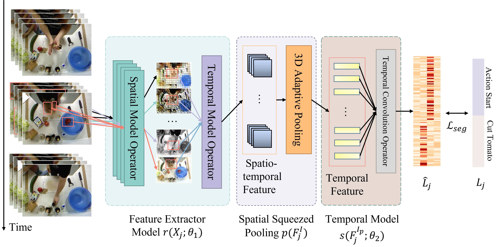
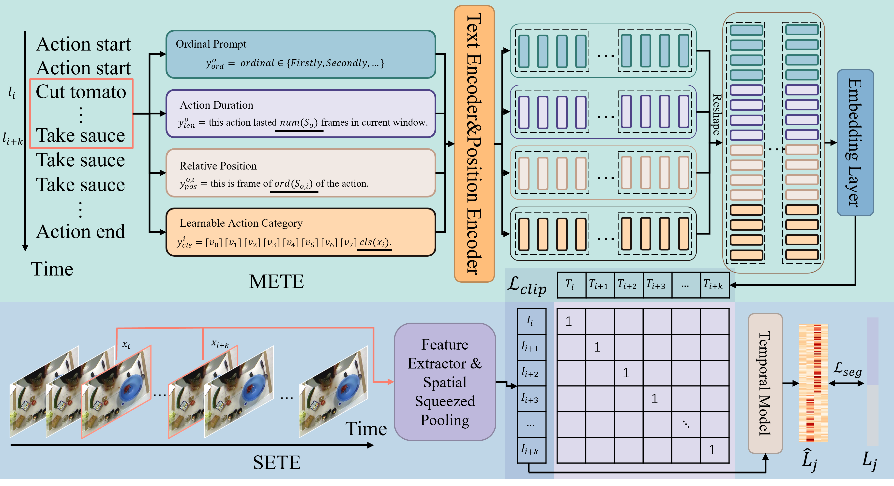

# SVTAS
Streaming Video Temporal Action Segmentation In Real Time

## Abstract

Temporal action segmentation (TAS) is a critical step toward long-term video understanding. Recent studies follow a pattern that builds models based on features instead of raw video picture information. However, we claim those models are trained complicatedly and limit application scenarios. It is hard for them to segment human actions of video in real time because they must work after the full video features are extracted. As the real-time action segmentation task is different from TAS task, we define it as streaming video real-time temporal action segmentation (SVTAS) task. In this paper, we propose a real-time end-to-end multi-modality model for SVTAS task. More specifically, under the circumstances that we cannot get any future information, we segment the current human action of streaming video chunk in real time. Furthermore, the model we propose combines the last steaming video chunk feature extracted by language model with the current image feature extracted by image model to improve the quantity of real-time temporal action segmentation. To the best of our knowledge, it is the first multi-modality real-time temporal action segmentation model. Under the same evaluation criteria as full video temporal action segmentation, our model segments human action in real time with less than 40% of state-of-the-art model computation and achieves 90% of the accuracy of the full video state-of-the-art model.

## Model Overview
### Streaming End-to-End Train Framework(SETE)


### Multi-modality End-to-End Train Framework(METE)


### Transeger


# Framework Feature
- [x] Distribution train
- [x] Tensorboard visualization
- [x] Caculate model Params and Flops
- [x] Apex accelerate
- [x] Apex ditributedd accelerate
- [x] Pillow-SMID accelerate sample

# Envirnment Prepare

- Linux Ubuntu 20.04+
- Python 3.8+
- PyTorch 1.11+
- CUDA 11.3+
- Cudnn 8.2+
- Pillow-SIMD (optional): Install it by the following scripts.

```bash
conda uninstall -y --force pillow pil jpeg libtiff libjpeg-turbo
pip   uninstall -y         pillow pil jpeg libtiff libjpeg-turbo
conda install -yc conda-forge libjpeg-turbo
CFLAGS="${CFLAGS} -mavx2" pip install --upgrade --no-cache-dir --force-reinstall --no-binary :all: --compile pillow-simd
conda install -y jpeg libtiff
```

- use pip to install environment

```bash
conda create -n torch python=3.8
python -m pip install --upgrade pip
pip install -r requirements.txt

# export
pip freeze > requirements.txt
```

# Baseline and Benckmark
- **FPF** means Flops Per Frame (G)
- **FPMF** means Flops Per Model  Forward (G)
- **FPS** means Frames Per Second (Hz)
- **No** means it can't be measured because this model is not real-time
- We used RTX3090 platform to measure

## GTEA
|Dataset   | Model               | Param(M) | FPF(G) | FPMF(G) | FPS(Hz) | Acc | AUC | mAP@0.5 | F1@0.1 |
| -----    | -----               |   -----  | -----  | -----   | -----   | --- | --- | ---     | ---    | 
| GTEA      | ViT+asformer(two-stage train) | 54.645 | no    | **85.8432** | no   | **81.00%} | -       | -       | **94.10%**|
| GTEA   | I3D+ms-tcn(two-stage train)   | **28.006** | no | 173.120 | no   | 79.20% | 82.92% | 64.45%| 87.5% |
| GTEA   | I3D+ms-tcn(single stage train)| 28.006 | 5.4100 | 173.120 |  433 | 43.93% | 59.20% | 13.03% | 42.44% |
| GTEA   | TSM+memory tcn+SETE(ours)     |  **2.372** | **0.3191** |  **10.017** | **3122** | 72.31% | **75.11%** | **49.50%** | 70.29% |
| GTEA   | Transeger(ours)               | 38.444 | 0.7955 |  25.457 | 1199 | **72.66%** | 72.24% | 39.77% | **72.36%** |

## 50Salads
|Dataset   | Model               | Param(M) | FPF(G) | FPMF(G) | FPS(Hz) | Acc | AUC | mAP@0.5 | F1@0.1 |
| -----    | -----               |   -----  | -----  | -----   | -----   | --- | --- | ---     | ---    | 
| 50Salads | ViT+asformer(two-stage train) | 54.645 | no   | **85.8432** | no   | **88.10%** | -   | -       | **89.20%** |
| 50Salads  | I3D+ms-tcn(two-stage train)   | **28.006** | no  | 173.120 | no   | 80.70% | -   | -       | 76.30% |
| 50Salads  | I3D+ms-tcn(single stage)      | 28.010 | 5.3995 | 172.786 |  433 | 30.31% | 48.00% | 7.13% | 12.36% |
| 50Salads  | TSM+memory tcn+SETE(ours)     |  **2.373** | **0.3130** |  **10.017** | **3122** | 79.85% | 75.00% | 58.73% | 48.51% |
| 50Salads  | Transeger(ours)               | 38.477 | 0.7955 |  25.457 |  1199 | **82.51%** | **75.68%** | **59.22%** | **54.99%** |

## EGTEA
|Dataset   | Model               | Param(M) | FPF(G) | FPMF(G) | FPS(Hz) | Acc | AUC | mAP@0.5 | F1@0.1 |
| -----    | -----               |   -----  | -----  | -----   | -----   | --- | --- | ---     | ---    | 
| EGTEA | I3D+m-GRU+GTRM(two-stage train) | - | no   | - | no   | **69.50%** | -   | -       | **41.60%** |
| EGTEA | I3D+ms-tcn(two-stage train)   | 28.006 | no  | 173.120 | no   | 69.20% | -   | -       | 32.10% |
| EGTEA | I3D+ms-tcn(single stage)      | 28.011 | 5.4100 | 173.120 | 433  | 59.43% |  2.94% | 0.60% |  2.76% |
| EGTEA | TSM+memory tcn+SETE(ours)     |  **2.373** | **0.3191** |  **10.213** | **3122** | **63.19%** |  **8.42%** | **3.27%** | **12.26%** |
| EGTEA | Transeger(ours)               | 38.482 | 0.7955 |  25.457 | 1199 | 60.89% |  7.01% |  1.90% | 11.52% |

# Prepare Data

Read Doc [Prepare Datset](doc/prepare_dataset.md)

# Model Train and Test

## Pre-train weight
- You can find some pre-train weight in [mmaction2](https://github.com/open-mmlab/mmaction2).

## Usage
- There are some `.sh` example files in `script` dictory. 

### Train

Switch `--validate` on to validating while training.

- multi-gpus train
```bash

export CUDA_VISIBLE_DEVICES=0,1,2,3

python -m paddle.distributed.launch \
    --nproc_per_node=4 \
    main.py \
    --launcher pytorch \
    --validate \
    -c CONFIG_PATH \
    --seed SEED
```
- single-gpu train
```bash
export CUDA_VISIBLE_DEVICES=0

python main.py \
    --validate \
    -c CONFIG_PATH \
    --seed SEED
```

Indicating `-c` to set configuration, and one can flexible add `-o` in the script to update it.

```bash
python -m paddle.distributed.launch \
    --nproc_per_node=4 \
    main.py \
    --launcher pytorch \
    --validate \
    -c CONFIG_PATH \
    --seed SEED
    -o DATASET.batch_size=BATCH_SIZE 
```
Indicating `-o DATASET.batch_size=BATCH_SIZE` can update batch size to BATCH_SIZE.

After starting training, log files will generated, and its format is shown as below, it will output to both the screen and files. Default destination of log is under the `.log/` folder, and stored in the files named like `worker.0`, `worker.1` ...

[train phase] current time, current epoch/ total epoch, batch id, metrics, elapse time, ips, etc.:

    [12/28 17:31:26] epoch:[ 1/80 ] train step:0   loss: 0.04656 lr: 0.000100 top1: 1.00000 top5: 1.00000 elapse: 0.326 reader: 0.001s ips: 98.22489 instance/sec.

[eval phase] current time, current epoch/ total epoch, batch id, metrics, elapse time, ips, etc.:


    [12/28 17:31:32] epoch:[ 80/80 ] val step:0    loss: 0.20538 top1: 0.88281 top5: 0.99219 elapse: 1.589 reader: 0.000s ips: 20.14003 instance/sec.


[epoch end] current time, metrics, elapse time, ips, etc.

    [12/28 17:31:38] END epoch:80  val loss_avg: 0.52208 top1_avg: 0.84398 top5_avg: 0.97393 elapse_avg: 0.234 reader_avg: 0.000 elapse_sum: 7.021s ips: 136.73686 instance/sec.

[the best Acc]  

    [12/28 17:28:42] Already save the best model (top1 acc)0.8494

### Resume

Indicate `-o resume_epoch` to resume, It will training from ```resume_epoch``` epoch, SVTAS will auto load optimizers parameters and checkpoints from `./output` folder, as it is the default output destination.

```bash
export CUDA_VISIBLE_DEVICES=0,1,2,3

python -m paddle.distributed.launch \
    --nproc_per_node=4 \
    main.py \
    --launcher pytorch \
    --validate \
    -c CONFIG_PATH \
    --seed SEED
    -o resume_epoch=5

```

### Finetune

Indicate `--weights` to load pretrained parameters, SVTAS will auto treat it as a finetune mission.

```bash
export CUDA_VISIBLE_DEVICES=0,1,2,3

python -m paddle.distributed.launch \
    --nproc_per_node=4 \
    main.py \
    --launcher pytorch \
    --validate \
    -c CONFIG_PATH \
    --seed SEED
    --weights=./outputs/example/path_to_weights
```

Note: SVTAS will NOT load shape unmatched parameters.

### Test

Switch `--test` on to start test mode, and indicate `--weights` to load pretrained model.

```bash
export CUDA_VISIBLE_DEVICES=0,1,2,3

python -m paddle.distributed.launch \
    --nproc_per_node=4 \
    main.py \
    --launcher pytorch \
    --test \
    -c CONFIG_PATH \
    main.py \
    -c ./configs/example.yaml \
    --weights=./output/example/path_to_weights
```

# Visualization
```bash
# gtea
python tools/convert_pred2img.py output/results/pred_gt_list data/gtea/mapping.txt output/results/imgs --sliding_windows 128
# 50salads
python tools/convert_pred2img.py output/results/pred_gt_list data/50salads/mapping.txt output/results/imgs --sliding_windows 600
```

# Citation
```bib
```