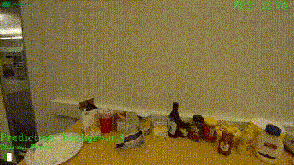
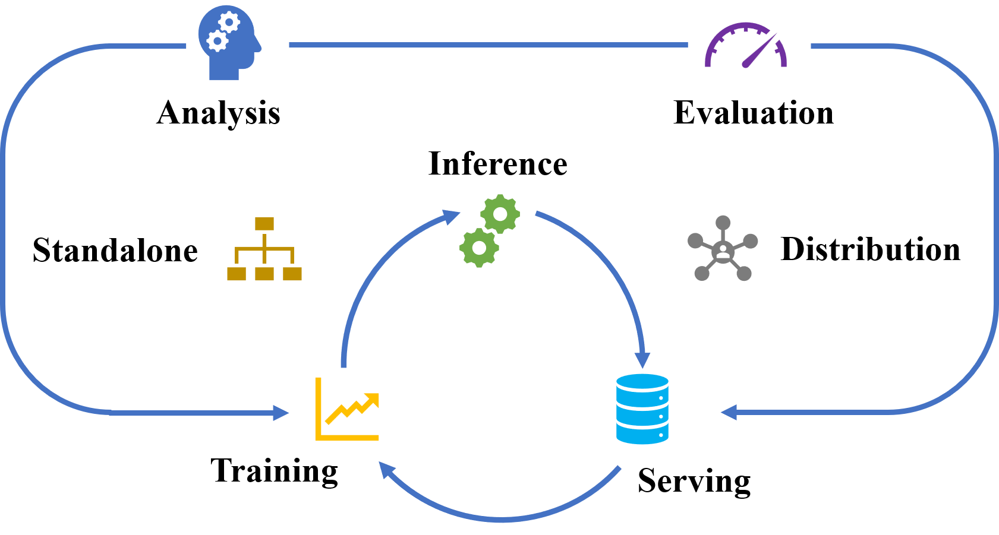

# **Important!**
**Warning**
- This repo **main** branch are under development so it will have much bugs, because it doesn't test completely!

**Note**
- If you want to reproduce paper list, please checkout branch to **svtas-paper**!

# Paper List
- Streaming Video Temporal Action Segmentation In Real Time, [](https://arxiv.org/pdf/2209.13808), **statu**: accepted by ISKE2023
- End-to-End Streaming Video Temporal Action Segmentation with Reinforce Learning, [](https://arxiv.org/abs/2309.15683), **statu**: accepted by TNNLS

## Streaming Video Temporal Action Segmentation
<div align="center">
  </div>

Our framework integrates **training**, **inference** and **deployment services** to meet the demand of streaming video temporal action segmentation, with the goal of creating an **AI Infra** framework for streaming video temporal action segmentation.

# Installation
See the SVTAS installation guide to install from pip, or build from source.

To install the current release:

```bash
python setup.py install .
```
To update SVTAS to the latest version, add --upgrade flag to the above commands.

# Framework Feature


<table>
<tbody>
<tr align="center" valign="bottom">
<td></td>
<td>
<b>Training</b>
</td>
<td>
<b>Inference</b>
</td>
<td>
<b>Serving</b>
</td>
</tr>
<tr valign="top">
<td align="center" valign="middle">
<b>Supports</b>
</td>
<td>
<ul>
<li><b>Autotunning</b></li>
<ul>
<li>Hyper-parameter search</a></li>
<li>Multi-trial</a></li>
</ul>
<li><b>Architecture search</b></li>
<ul>
<li>NAS</a></li>
</ul>
<li><b>Evaluation</b></li>
<ul>
<li>FLOPs</a></li>
<li>Param</a></li>
<li>Performance</a></li>
</ul>
</ul>
</td>
<td>
<ul>
<li><b>Quantization</b></li>
<ul>
<li>Todo</a></li>
</ul>
<li><b>Pruning</b></li>
<ul>
<li>Todo</a></li>
</ul>
<li><b>Evaluation</b></li>
<ul>
<li>FLOPs Comapre</a></li>
<li>Param</a></li>
<li>Precision comparison</a></li>
</ul>
</ul>
</td>
<td>
<ul>
<li><b>Server</b></li>
<ul>
<li>Todo</a></li>
</ul>
<li><b>Client</b></li>
<ul>
<li>Todo</a></li>
</ul>
<li><b>Evaluation</b></li>
<ul>
<li>Throughput</a></li>
<li>Latency</a></li>
<li>Resource</a></li>
</ul>
</ul>
</td>
<tr align="center" valign="bottom">
<td></td>
<td>
<b>Model Zoom</b>
</td>
<td>
<b>Tutorials</b>
</td>
<td>
<b>Services Component</b>
</td>
</tr>
<tr valign="top">
<td align="center" valign="middle">
<b>Algorithms</b>
</td>
<td>
<ul>
<li><a href="https://arxiv.org/abs/1903.01945">MS-TCN</a></li>
<li><a href="https://arxiv.org/abs/2110.08568">ASFormer</a></li>
<li><a href="https://arxiv.org/abs/2007.06866">ASRF</a></li>
<li><a href="https://arxiv.org/abs/2112.01402">C2F-TCN</a></li>
<li><a href="https://arxiv.org/pdf/2209.13808">Transeger</a></li>
<li><a href="https://arxiv.org/abs/2303.17959">Diffact</a></li>
<li>More...</li>
</ul>
</td>
<td>
<ul>
<li>CAM Visualization</li>
<li>DeepSpeed</li>
<li>Tritron (Todo)</li>
</ul>
</td>
<td>
<ul>
<li>Local Machine</li>
<li>Distribution Machine</li>
<li>Assemble Pytest Framweork</li>
<li>Tensorboard</li>
<li>ONNXRuntime</li>
<li>TensorRT</li>
</ul>
</ul>
</td>
</tbody>
</table>

# Envirnment Prepare

- Linux Ubuntu 22.04+
- Python 3.10+
- PyTorch 2.1.0+
- CUDA 12.2+ 
- Pillow-SIMD (optional): Install it by the following scripts.
- FFmpeg 4.3.1+ (optional): For extract flow and visualize video cam

```bash
conda uninstall -y --force pillow pil jpeg libtiff libjpeg-turbo
pip   uninstall -y         pillow pil jpeg libtiff libjpeg-turbo
conda install -yc conda-forge libjpeg-turbo
CFLAGS="${CFLAGS} -mavx2" pip install --upgrade --no-cache-dir --force-reinstall --no-binary :all: --compile pillow-simd
conda install -y jpeg libtiff
```

- use pip to install environment

```bash
conda create -n torch python=3.10
python -m pip install --upgrade pip
pip install -r requirements/requirements_base.txt
```
- If report `correlation_cuda package no found`, you should read [Install](svtas/model/backbones/utils/liteflownet_v3/README.md)
- If you want to extract montion vector and residual image to video, you should install ffmpeg, for example, in ubuntu `sudo apt install ffmpeg`

# Document Dictionary
- [Prepare Datset](docs/prepare_dataset.md)
- [Usage](docs/usage.md)
- [Model Zoo](docs/model_zoo.md)
- [Tools Usage](docs/tools_usage.md)
- [Infer Guideline](docs/infer_guideline.md)
- [Add Test Case Guideline](docs/add_testcase_guideline.md)

# Citation
```bib
@misc{2209.13808,
Author = {Wujun Wen and Yunheng Li and Zhuben Dong and Lin Feng and Wanxiao Yang and Shenlan Liu},
Title = {Streaming Video Temporal Action Segmentation In Real Time},
Year = {2022},
Eprint = {arXiv:2209.13808},
}

@article{wen2023end,
  title={End-to-End Streaming Video Temporal Action Segmentation with Reinforce Learning},
  author={Wen, Wujun and Zhang, Jinrong and Liu, Shenglan and Li, Yunheng and Li, Qifeng and Feng, Lin},
  journal={arXiv preprint arXiv:2309.15683},
  year={2023}
}
```
# Acknowledgement
This repo borrowed code from many great open source libraries, thanks again for their selfless dedication.
- [mmaction2](https://github.com/open-mmlab/mmaction2)
- [paddlevideo](https://github.com/PaddlePaddle/PaddleVideo)
- [SlowFast](https://github.com/facebookresearch/SlowFast)

# License
The entire codebase is under [Apache2.0 license](LICENSE).
