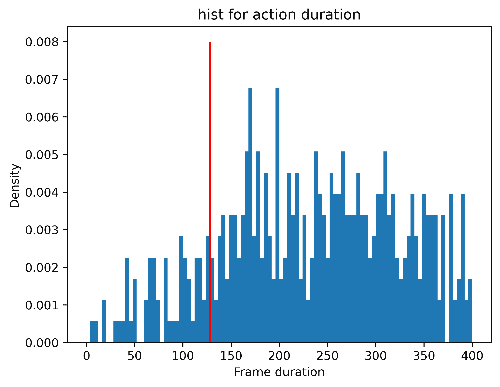
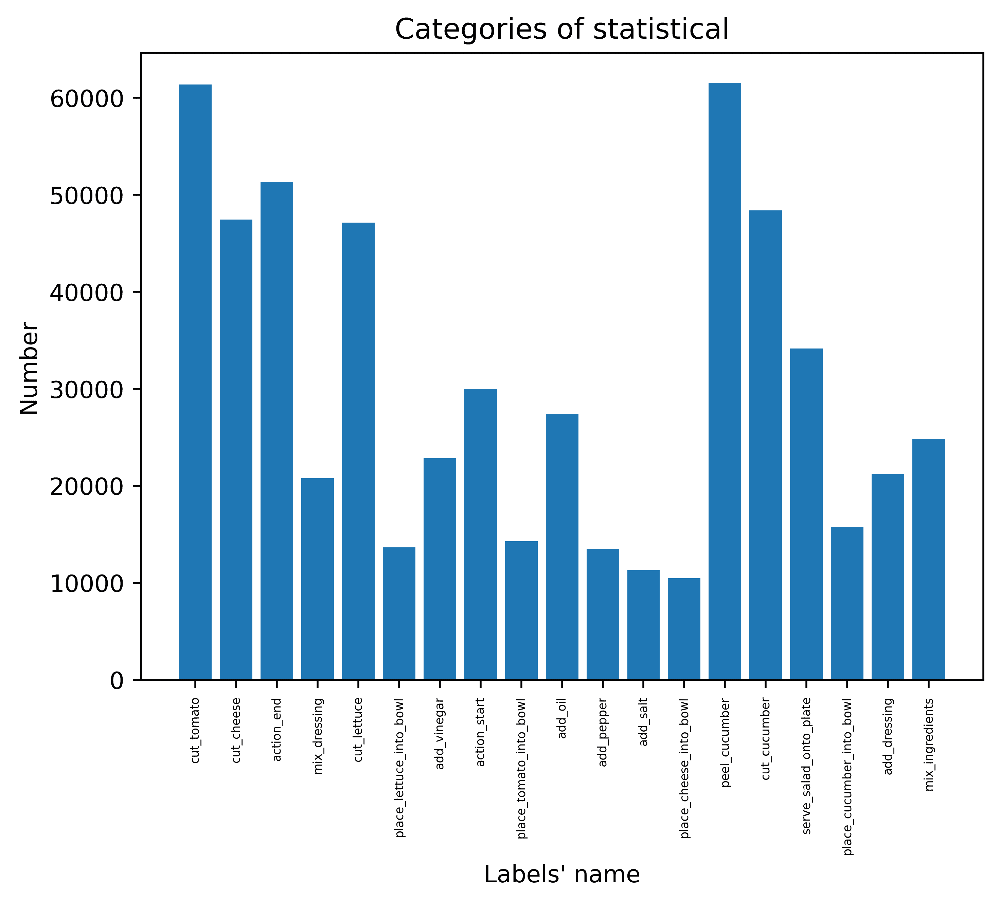
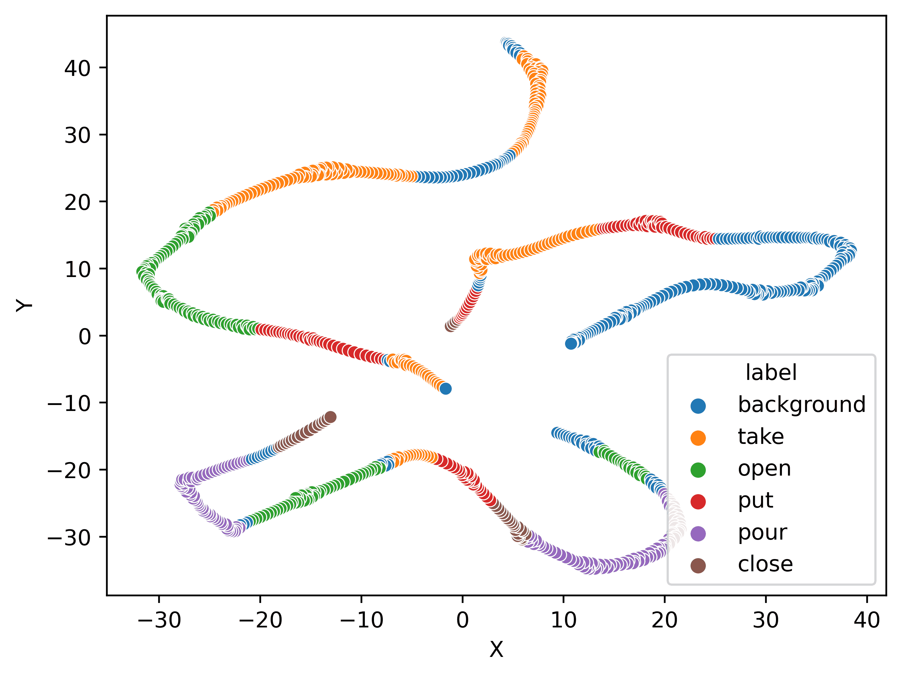
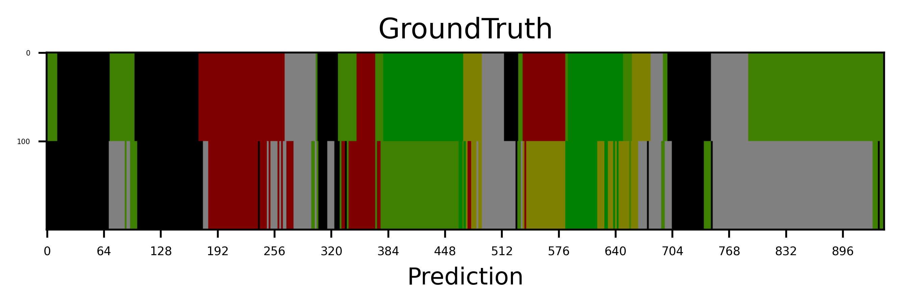
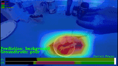

# Tools Usage
This document shows some useful visualization analysis tools, help user to analysis model and dataset.

## Labels Statistic Analysis
This tools will give statistic data for dataset, help to analysis windows size and classification unbalance.

```bash
# for gtea
python tools/data_anlysis/statistic_labels_num.py data/gtea/splits/all_files.txt data/gtea/groundTruth data/gtea/mapping.txt output
# for 50salads
python tools/data_anlysis/statistic_labels_num.py data/50salads/splits/all_files.txt data/50salads/groundTruth data/50salads/mapping.txt output
# for breakfast
python tools/data_anlysis/statistic_labels_num.py data/breakfast/splits/all_files.txt data/breakfast/groundTruth data/breakfast/mapping.txt output
```
### Example
<center class="half">


</center>

# Feature Manifold Analysis
We use `t-sne` method visualize manifold to help user to analysis.
```bash
python tools/visualize/t_sne_visualize.py -i data/gtea/features/S1_Cheese_C1.npy -l data/gtea/groundTruth/S1_Cheese_C1.txt -o output
```
### Example
<div align="center">
  </div>

# Label Prediction Analysis
This tools will visualize groundtruth and prediction labels help user to analysis model prediction.
```bash
# gtea
python tools/convert_pred2img.py output/results/pred_gt_list data/gtea/mapping.txt output/results/imgs --sliding_windows 128
# 50salads
python tools/convert_pred2img.py output/results/pred_gt_list data/50salads/mapping.txt output/results/imgs --sliding_windows 600
```
### Example
<div align="center">
  </div>

# Classification Activation Map Visualization
We assemble [grad-cam](https://github.com/jacobgil/pytorch-grad-cam) repo for user to visualize model classification activation map.
```bash
python tools/visualize/cam_visualization.py -c config/cam_visualize/swin_v2_transformer_fc_visualize.py -o output --method gradcam
```
### Example
<div align="center">
  </div>
